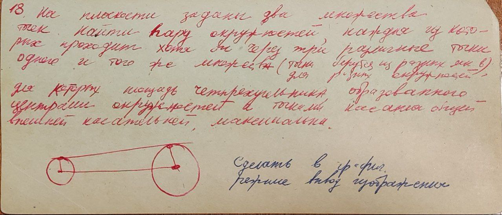

# Electron + React + Vite 

## Task:

> № 18 **На плоскости заданы два множества точек. Найти пару окружностей, каждая из которых проходит хотя бы через `3`
различные точки одного и того же множества (точки берутся из разных множеств для разных окружностей), для которых
площадь четырехугольника, образованного центрами окружностей и точками касания общей касательной, максимальна.**

## GitHub Pages
Лабораторную можно **[посмотреть](https://ya4alex.github.io/KG-IU7/lab_01)** непосредственно в этом репозитории
на **github pages**.  

## About:
1. ### Загрузка
    Скачать репозиторий \
    `git clone https://github.com/Ya4alex/KG-IU7.git` \
    `cd KG-IU7/lab_01_18`
2. ### Установка зависимостей
    > Требуется [`npm`](https://docs.npmjs.com/downloading-and-installing-node-js-and-npm) 
для установки необходимых библиотек. 

    `npm i` - запускает загрузку и установку зависимостей
3. ### Dev сборка / запуск
    > Для сборки приложения используется [electron + vite](https://electron-vite.github.io). 

    `npm run dev` - соберет и запустит realtime dev сборку
4. ### Сборка
    `npm run buid` - сборка electron приложения под текущую операционную систему

   > `npm run build:win` - windows \
   > `npm run build:mac` - macOS   \
   > `npm run build:lnx` - linux 
